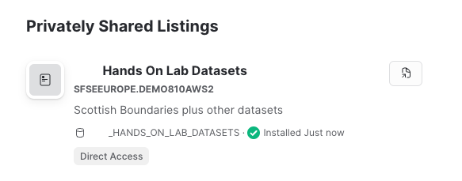
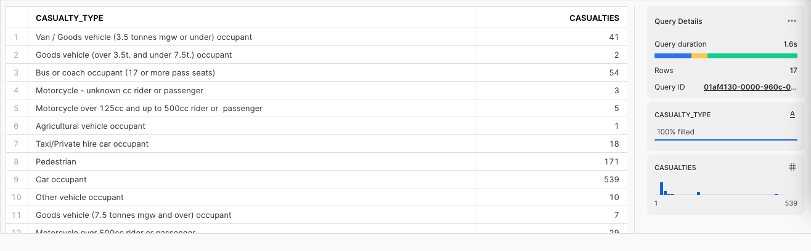
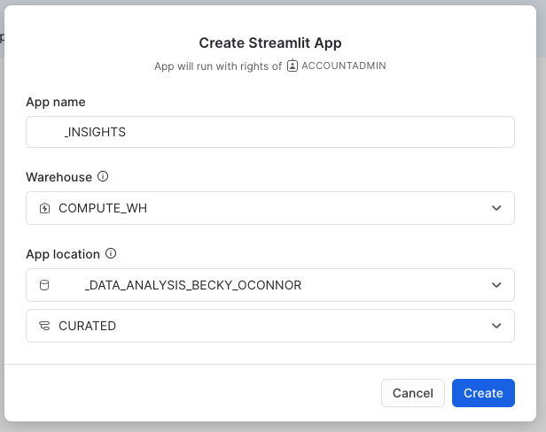
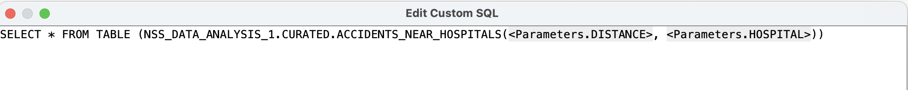
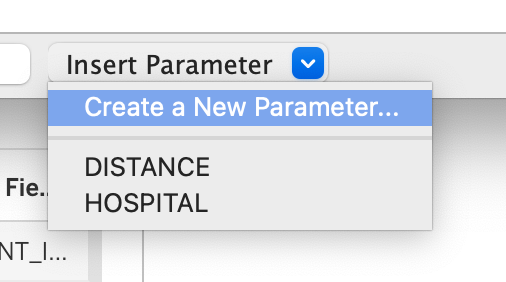

# Analysing Shared Data Sets
By Rebecca O'Connor - becky.oconnor@snowflake.com

The following Hands on Lab will take you though collecting data from a data share, exploring the data with some sample SQL queries, then you will create a database with views from the share so you can then create a streamlit application based on the sample code.


* Login with your given username and password


*   Click on the Data Icon - you will see a sample database called SNOWFLAKE_SAMPLE_DATA.  For this lab, we will be using a data from the shared private listing.  The datashare was previewed to you in the initial demo by the provider.


* Click on Private Sharing.  You should see one Privately Shared Listing



* Click on the Listing to view more details about the dataset.  You will see some information about the data  via the data dictionary.  I have featured 4 of the datasets but you do have the option to view all 11 objects.   Take some time to explore the datasets available in the listing.

If you have access to other listings from other providers - or even your own datasets, you have the ability to combine them together easily.

You will also see usage examples with sample sql queries.  When you press open, these sql examples will be available inside a Snowflake worksheet.

* Press **Open** to open the dataset into a new worksheet


Opening up the **Raw** Schema of the HANDS_ON_LAB_DATASETS database will reveal all the tables within the explorer area


* Highlight **IMD_2020** to reveal information about the table - which also includes a dictionary which explains what some of the fields mean.


#### Running queries from a snowsight worksheet

* We will now focus on the supplied worksheet.  There are a few sophisticated queries in here.


##### Running your first Query

* Position your mouse cursor anywhere inside the first sample query.

    **TIP** - you do not have to highlight the query, the run button will only run up until the end of the query (where you see the semi colon)


* Above is a screenshot of the first query.  To run the query, press ctrl/command and enter.  Alternatively, you can press the run button at the top right hand corner of the screen.  

* When you run the first query, you will see the results appear at the bottom of the screen.  Press  at the bottom left hand corner of the screen to colapse the editor.

* View the **Query details** on the right - this is a great place to view some quick insights into the shape of your data.  It gives you the ability to see the data as you engineer it before you use it in Tableau.


* You can do filtering and and sorting as well - take your time to explore this.

* The chart allows you to view the data quickly as a chart.  Below is an example of what you can create.


Press  on the bottom left hand side of the screen to open up the SQL editor again.

##### Notes on the query you have just ran

You have just ran a query which filters all the indicies of deprivation metrics by health board.  NB: the Health Boards were not connected to the deprivation dataset.  What you have achieved is that you have created a spatial join to link the Datazone geography boundaries to the Health board boundaries.  The join we used is one of the many hundreds of standard analyitical capabilities that Snowflake has available right outside the box.

You will note we are not viewing the  geography fields (which consist of json containing coordinates) in the table.  I have simply excluded them from the query via the **EXCLUDE** feature.

##### Running Query 2 - A summary of casualty types for the Lothian health board

* Ctrl and enter inside the second query to run it as before.  This returns a small dataset which shows the number of queries by casualty type.  We are filtering it to only view one health board in the same way as previously.

##### Query Result




##### Notes on the Query

As before, we filtered the health boards and joined this result to the vehicle incident data.  The vehicle incident dataset also does not have the Scotish Health Boards - so simply using the spatial join resolves the problem.

The vehicle incident dataset also does not have descriptions of the casualty types - so we joined the vehicle incident data to the lookup table which gave me all the descriptions we needed.

##### View a List of Hospitals within a specified distance around a chosen postcode

* Amend the next query to a postcode of your choice  

* At the end of the query you will see the number 3000, this means it will reveal all the hospitals within a 3km radius of that postcode. Please note that it will only find hospitals in Scotland!!


* Press Ctrl + Enter to run the query.

##### Notes on the prevously ran query

This query is making use of the function ST_DWITHIN which basically matches locations that sit inside another location BUT with a user defined tolerence level - in this case I used 3000 which means 3km.

The Hospitals itself did not have the locations attached to them - only the postcodes - so i first needed to join to the postcode table which then revealed the POINT for each postcode.

##### Next Query - Combine Weather Data and Vehicle incident data for the Lothian Health Board

* Ctrl + Click to run the next query in order to view a combined vehicle incident and weather data table which is filtered by health board.    


* The final queries take you through simple steps to view tables, then join them together.  Run these individually as you wish.


#### Populate your own local database

So far we have worked with a datashare.  Now, we will take some of this information and organise it into a local database.

This database will be used to furnish a streamlit application.  The application will utilise Snowpark for Python Dataframes.


* Create a New SQL Worksheet.  You will see this as a menu item from the home page 


* Copy and paste the following into your new worksheet - TIP - you will need to highlight all the commands which you have pasted below to run just these commands at the same time.


```sql
USE DATABASE NSS_DATA_ANALYSIS_<<REPLACE_WITH_YOUR_DATABASE_NUMBER>>;

CREATE OR REPLACE SCHEMA CURATED;

CREATE OR REPLACE VIEW HEALTH_BOARDS AS SELECT * FROM NSS_HANDS_ON_LAB_DATASETS.RAW.HEALTH_BOARDS;

CREATE OR REPLACE VIEW IMD_2020 AS SELECT * FROM NSS_HANDS_ON_LAB_DATASETS.RAW.IMD_2020;

CREATE OR REPLACE VIEW UK_VEHICLE_ACCIDENTS AS SELECT * FROM NSS_HANDS_ON_LAB_DATASETS.RAW.UK_VEHICLE_ACCIDENTS;

CREATE OR REPLACE VIEW POSTCODES AS SELECT * FROM NSS_HANDS_ON_LAB_DATASETS.RAW.POSTCODES;

CREATE OR REPLACE VIEW MET_OFFICE_WEATHER_IN_2021 AS SELECT * FROM NSS_HANDS_ON_LAB_DATASETS.RAW.MET_OFFICE_WEATHER_IN_2021;

```

This will create a new database with a schema.  Inside, various views will be populated based on data shared by the provider.  These are the only views needed to create the streamlit application in this workshop.

However we will also do more experimentation will now have ago at creating other objects within the database

##### Creating a table based on selecting information from multiple tables

* Copy and paste the following code into your worksheet and run it.  You are simply creating a table based on several tables used from the private listing

```sql
CREATE OR REPLACE TABLE CASUALTIES_BY_HEALTH_BOARD AS 


SELECT HEALTH_BOARD_NAME, B.VALUE CASUALTY_TYPE, COUNT(*) CASUALTIES FROM (

SELECT A.*, B.* EXCLUDE ACCIDENT_INDEX FROM (

SELECT A.* EXCLUDE GEOGRAPHY,B.ACCIDENT_INDEX FROM (

SELECT GEOGRAPHY,HEALTH_BOARD_CODE, HEALTH_BOARD_NAME FROM CURATED.HEALTH_BOARDS

) A


INNER JOIN 


CURATED.UK_VEHICLE_ACCIDENTS B ON ST_WITHIN(B.POINT,A.GEOGRAPHY)

) A

INNER JOIN NSS_HANDS_ON_LAB_DATASETS.RAW.UK_VEHICLE_CASUALTIES B ON A.ACCIDENT_INDEX = B.ACCIDENT_INDEX

) A 

INNER JOIN (SELECT * FROM NSS_HANDS_ON_LAB_DATASETS.RAW.UK_VEHICLE_LOOKUPS WHERE DATASET = 'Casualty' AND FIELD = 'casualty_type') B

ON A.CASUALTY_TYPE = B.CODE GROUP BY ALL;

SELECT * FROM CASUALTIES_BY_HEALTH_BOARD
```

* Create an Indicies of Deprivation table which includes all the health board names

```sql
CREATE OR REPLACE TABLE INDICIES_OF_DEPRIVATION AS 

SELECT A.* EXCLUDE GEOGRAPHY,B.* EXCLUDE GEOGRAPHY FROM (

SELECT GEOGRAPHY,HEALTH_BOARD_CODE, HEALTH_BOARD_NAME FROM NSS_HANDS_ON_LAB_DATASETS.RAW.HEALTH_BOARDS

) A


INNER JOIN 


NSS_HANDS_ON_LAB_DATASETS.RAW.IMD_2020 B ON ST_DWITHIN(B.GEOGRAPHY,A.GEOGRAPHY,20);

select * from INDICIES_OF_DEPRIVATION
```


#### Creating a Function

Here, we will create a function that simply allows a selection of vehicle incidents near a chosen hospital and chosen distance (in Metres).  You can use this in other applications - such as Tableau!


```sql

CREATE OR REPLACE FUNCTION ACCIDENTS_NEAR_HOSPITALS(distance NUMBER, hospital_name VARCHAR)

RETURNS TABLE (

ACCIDENT_INDEX varchar,
ACCIDNT_YEAR number,
DATE date,
TIME time,
LATITUDE float,
LONGITUDE float,
HOSPITAL_NAME varchar )

as $$

SELECT ACCIDENT_INDEX,ACCIDENT_YEAR,DATE,TIME,A.LATITUDE,A.LONGITUDE,"HospitalName"  FROM (

SELECT * FROM NSS_HANDS_ON_LAB_DATASETS.RAW.UK_VEHICLE_ACCIDENTS) A


INNER JOIN


(SELECT * EXCLUDE LATITUDE,LONGITUDE FROM (


SELECT A."Postcode",LATITUDE,LONGITUDE,"Point","HospitalName" FROM 
NSS_HANDS_ON_LAB_DATASETS.RAW.POSTCODES A RIGHT JOIN

(SELECT "HospitalCode","HospitalName","Postcode" FROM 


NSS_HANDS_ON_LAB_DATASETS.RAW.HOSPITALS WHERE "HospitalName" like hospital_name) B

ON A."Postcode" = B."Postcode" ) ) B 


ON

ST_DWITHIN(A.POINT,B."Point",distance) $$;

SELECT * FROM TABLE (ACCIDENTS_NEAR_HOSPITALS(500, 'Dundee Dental Hospital'));
```

You can also create a table function:

* Copy and paste the following code to create a Point Geocode function based on the Postcodes table


```sql
CREATE OR REPLACE FUNCTION Points_of_a_postcode(postcode varchar)
  RETURNS geography
  AS
  $$
    SELECT ST_POINT(LONGITUDE,LATITUDE) FROM POSTCODES WHERE "Postcode" = postcode LIMIT 1
  $$
  ;
-------Test out the function here
  SELECT  Points_of_a_postcode('DY13 9GN') POINT,
          ST_Y(POINTS_OF_A_POSTCODE('DY13 9GN')) LATITUDE,
          ST_X(Points_of_a_postcode('DY13 9GN')) LONGITUDE
```


* Refresh the Databases explorer to the new content inside your database

####  Simple Time Travel Time Travel

Snowflake allows you to go back to a point in time in order to go back in time before changes occured.  There is a seperate time travel hands on lab which takes you through the details.

https://quickstarts.snowflake.com/guide/getting_started_with_time_travel/index.html?index=..%2F..index#0


In this session, we will explore the use of undrop which is useful if you accidently drop an object.


* Select all data from one table
```sql

SELECT * FROM CASUALTIES_BY_HEALTH_BOARD;
```
* Drop the table
```sql

DROP TABLE CASUALTIES_BY_HEALTH_BOARD;
```
* Select the table again - you should see an error that the table is not found

```sql
SELECT * FROM CASUALTIES_BY_HEALTH_BOARD;
```

* You have made an error - so undrop the table

```sql
UNDROP TABLE CASUALTIES_BY_HEALTH_BOARD;
```

* Now select the table again - it should now be restored

```sql
SELECT * FROM CASUALTIES_BY_HEALTH_BOARD;
```

Now we can see how easy it is to restore a table, what about an entire database?

* Drop the database you have access to

```sql
DROP DATABASE NSS_DATA_ANALYSIS_<<DATABASE_NUMBER>>;
```
* Try and use the database you have just dropped - you should get an error.

```sql
USE DATABASE NSS_DATA_ANALYSIS_<<DATABASE_NUMBER>>;
```

* Undrop the database - It will now be restored and ready for querying again.

```sql
UNDROP DATABASE NSS_DATA_ANALYSIS_<<DATABASE_NUMBER>>;
```

#### Database Cloning
You may wish do use a zero copy clone of a database for developmental purposes.

* Try the following to clone your database - this will only copy the meta data, but any changes you make on the clone will not impact the original database

```sql
CREATE DATABASE NSS_DATA_ANALYSIS_<<DATABASE_NUMBER>>_CLONE CLONE NSS_DATA_NALYSIS_<<DATABASE_NUMBER>>;
```


#### Streamlit in Snowflake - Now in Public Preview

You have created various views, tables and functions and have also cloned the database.  Now it's time to create an application based on the data created

* Go back to the home page and click on the button **Streamlit**

* Press  to create a new Streamlit Application

* Deploy the app in the following location



Then press **Create**

Here you can create an application using Snowpark for Python dataframes and the Streamlit application framework.  You will see an example application.

Lets create our first application 


* Remove the sample code and copy and paste the following code  into the canvas

```python
# Import python packages
import streamlit as st
from snowflake.snowpark.context import get_active_session

# Write directly to the app
st.title("My First Application")

# Get the current credentials
session = get_active_session()

deprivation = session.table('IMD_2020').drop('GEOGRAPHY')


st.dataframe(deprivation,use_container_width=True)
```


If you are familar with Python Dataframes, this will be familar to you.

So in just a few lines of code you can display data held in snowflake via a data share into an application.


Now we will add a more sophisticated application.


* Highlight the code created and delete it
* Copy the following code into the canvas 

* In packages, add the package **pydeck** 
* Run the app

```python
# Import python packages
import streamlit as st
from snowflake.snowpark.context import get_active_session
from snowflake.snowpark import functions as F
from snowflake.snowpark import types as T
import pandas as pd
import altair as alt
import numpy as np
import pydeck as pdk
import json

st.set_page_config(layout="wide")
# Write directly to the app
st.title('VEHICLE INCIDENTS IN SCOTLAND')
st.subheader('Vehicle Incidents occuring within a health board')

# Get the current credentials
session = get_active_session()

# load raw dataframes
boards = session.table('HEALTH_BOARDS')
board_names = boards.select('HEALTH_BOARD_NAME').distinct().to_pandas()

#select the health board to filter all the data

bname = st.selectbox('Choose Health Board: ', board_names)

#filter the healthboard boundaries to only have the chosen healthboard - also locate the centroid
#so we can position the map

board_filtered2 = boards.filter(F.col('HEALTH_BOARD_NAME') == bname)\
.with_column('centroid',F.call_function('ST_CENTROID',F.col('GEOGRAPHY')))\
.with_column('LATITUDE',F.call_function('ST_Y',F.col('CENTROID')))\
.with_column('LONGITUDE',F.call_function('ST_X',F.col('CENTROID')))


#load the board details to pandas so we can print out the co-ordinates
boardinfo = board_filtered2.to_pandas()


#position the coordinates into 2 columns
geoma,geomb = st.columns(2)


with geoma:
    st.write(f'''Latitude: {boardinfo.LATITUDE.iloc[0]}''')
with geomb:
    st.write(f'''Longitude: {boardinfo.LONGITUDE.iloc[0]}''')


#remove the centroid longitude and latitude to avoid confusion with the co-ordinates 
#of the more detailed datasets

board_filtered = board_filtered2.drop('LONGITUDE','LATITUDE')

IMD = session.table('IMD_2020')

IMD2 = IMD.join(board_filtered,F.call_function('ST_DWITHIN',
                                               IMD['GEOGRAPHY'],
                                               board_filtered['GEOGRAPHY'],20),
                lsuffix='L')


IMD3 = IMD2.select('"DZName"',
                   'GEOGRAPHYL',
                   '"EduAttain"',
                   '"CrimeCount"',
                   '"EmpNumDep"',
                  '"GAccDTGP"')


ACCIDENTS = session.table('UK_VEHICLE_ACCIDENTS')
CASUALTIES = session.table('UK_VEHICLE_CASUALTIES')

weather = session.table('MET_OFFICE_WEATHER_IN_2021')


filtered_weather = weather.join(board_filtered,
                                F.call_function('ST_WITHIN',
                                                weather['POINT'],
                                                board_filtered['GEOGRAPHY']),lsuffix='l').drop('GEOGRAPHY','HEALTH_BOARD_CODE','HEALTH_BOARD_NAME','AREA')

ACCIDENTS_FILTERED = ACCIDENTS.join(board_filtered,
                                    F.call_function('ST_WITHIN',
                                                    ACCIDENTS['POINT']            
                                                    ,board_filtered['GEOGRAPHY']))


ACCIDENTS_IMD = ACCIDENTS_FILTERED.join(IMD3,F.call_function('ST_WITHIN',
                                             ACCIDENTS_FILTERED['POINT'],
                                                  IMD3['GEOGRAPHYL']))\
.group_by(F.col('"DZName"')).agg(F.sum('NUMBER_OF_CASUALTIES').alias('"Casualties Involved in Incidents"')
                                        ,F.mean('"EduAttain"').alias('"Education of school leavers"')
                                        ,F.mean('"CrimeCount"').alias('"Number of Recorded Crimes"')
                                        ,F.mean('"EmpNumDep"').alias('"Number who are Employment Deprived"')
                                        ,F.mean('"GAccDTGP"').alias('"Drivetime to Surgery"')
                                
                                
                                )


map_data2 = ACCIDENTS_FILTERED.drop('POINT','GEOGRAPHY','CENTROID','AREA').to_pandas()


map_data3 = pd.DataFrame()
map_data3['lat'] = map_data2['LATITUDE']
map_data3['lon'] = map_data2['LONGITUDE']


st.pydeck_chart(pdk.Deck(
    map_style=None,
    initial_view_state=pdk.ViewState(
        latitude=boardinfo.LATITUDE.iloc[0],
        longitude=boardinfo.LONGITUDE.iloc[0],
        zoom=8,
        pitch=50,
    ),
    layers=[
        pdk.Layer(
           'HexagonLayer',
           data=map_data3,
           get_position='[lon, lat]',
           radius=400,
           elevation_scale=4,
           elevation_range=[0, 3000],
           pickable=True,
           extruded=True,
        ),
        pdk.Layer(
            'ScatterplotLayer',
            data=map_data3,
            get_position='[lon, lat]',
            get_fill_color=[180, 0, 200, 140],
            get_radius=500,
        ),
    ],
))


def deprivation_columns():
    columns = ACCIDENTS_IMD.drop('"DZName"').columns
    refactored = [s.strip('"') for s in columns]
    return refactored


dep1,dep2,dep3 = st.columns(3)
with dep1:
    x = st.selectbox("Select X Axis:",deprivation_columns())

with dep2:
    y = st.selectbox("Select Y Axis:",deprivation_columns())

with dep3:
    z = st.selectbox("Select Size",deprivation_columns())


st.markdown('#### SCATTER PLOT ANALYSING PATTERNS BETWEEN 3 METRICS')


scatter = alt.Chart(ACCIDENTS_IMD.to_pandas()).mark_point(size=60, opacity=1).encode(
    x=x,
    y=y,
    size=z,
    color=alt.value('pink'),
    tooltip=['DZName', x, y, z]
).interactive()


st.altair_chart(scatter,use_container_width=True)


VEHICLE_ACCIDENTS_DATE = ACCIDENTS_FILTERED.with_column('MONTH',F.monthname('DATE'))\
.with_column('MONTH_NUMBER',F.month('DATE'))\
.group_by(F.col('Month')).agg(F.sum('NUMBER_OF_CASUALTIES').alias('NUMBER_OF_CASUALTIES'),F.sum('NUMBER_OF_VEHICLES').alias('NUMBER_OF_VEHICLES'))

WEATHER_DATE = filtered_weather.with_column('MONTH',F.monthname('DATE')).with_column('MONTH_NUMBER',F.month('DATE'))\
.group_by(F.col('Month')).agg(F.any_value('MONTH_NUMBER').alias('MONTH_NUMBER'),
F.sum('"Total Rainfall Amount in the period 06-21Z"').alias('RAINFALL'),
F.sum('"Max (10min mean) 10m Wind Speed in the period 06-21Z"').alias('WIND'),
F.sum('"Total Snowfall Amount in the period 06-21Z (falling, not necessarily settling)"').alias('SNOW'))

WEATHER_WITH_INCIDENTS = WEATHER_DATE.join(VEHICLE_ACCIDENTS_DATE,'MONTH')

PDW = WEATHER_WITH_INCIDENTS.to_pandas()


data = PDW.reset_index()
base = alt.Chart(data).encode(x='MONTH')


b = base.mark_bar(color='pink').encode(y='NUMBER_OF_CASUALTIES')
a = base.mark_line(color='black').encode(y='SNOW')
d = base.mark_line(color='black').encode(y='RAINFALL')
e = base.mark_line(color='black').encode(y='WIND')

st.markdown('#### VEHICLE INCIDENTS WITH WEATHER DATA')
col1,col2,col3 = st.columns(3)

with col1:
    z = alt.layer(b,a).resolve_scale(y='independent')
    st.altair_chart(z,use_container_width=True)

with col2:
    x = alt.layer(b,d).resolve_scale(y='independent')
    st.altair_chart(x,use_container_width=True)

with col3:
    y = alt.layer(b,e).resolve_scale(y='independent')
    st.altair_chart(y,use_container_width=True)
```

#### Have a play with the application - and if you like, feel free to make changes

Go to the Streamlit documentation to view how other streamlit widgets work.

https://streamlit.io/components

Below is what the application should look like.


Also, now you have a database, consider using the sample queries to create some new views or tables based on those examples.

It's as simple as the examples below... 


```sql
CREATE VIEW MYVIEW AS SELECT * FROM MYQUERY; 
CREATE TABLE MYTABLE AS SELECT * FROM MYQUERY
```


#### Tableau Integration

Connecting your new database to tableau is easy.  


* Launch Tableau Desktop

* In the Home page, within connect to a server, select Snowflake

* Put in your credentials and press Sign in


* In select warehouse, choose the compute available to you.

* In Database select the NSS_HANDS_ON_LAB_DATASETS

* Drag IMD_2020 into the data model.

* In the Canvas double click on the Geography field to draw a map

* Drag DZName into the detail

* Drag Crime Count into the Colour

* If you change the pallette to diverging, you should get something like this:


NB - Use Snowflake to do any geocoding /transforms before you load into tableau - keep this at the source.  You can utilise Functions if you need this to be dynamic.


#### Data Source 2 Exercise

Here we are going to leverage the table function we created earlier and use this dynamically inside of Tableau.

* Instead of selecting a table, Create a Custom SQL query.  You should be able to do something like this:



You will need to create new tableau parameters as per the screenshot below:



This will allow you to use the function dynamically as you query the data inside of tableau.

TIP - you can also utlise the scalar functions as tableau calculations.


If you have time, have a play with creating tableau views by utilising the tables/views created in snowflkake.


