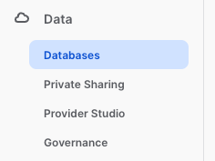
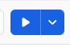

# Hands on Lab focusing on Scotish Health Boards
By Rebecca O'Connor - becky.oconnor@snowflake.com

The following Hands on Lab will take you though collecting data from a data share, exploring the data with some sample SQL queries, then you will create a database with views from the share so you can then create a streamlit application based on the sample code.

### Login with your given username and password

*   Click on the Data Icon - you will see a sample database called SNOWFLAKE_SAMPLE_DATA.  For this lab, we will be using a data from a data share

* Click on Private Sharing.  You should see one Privately Shared Listing

* Click on the Listing to view more details about the dataset.  You will see some information about the data  via the data dictionary.  I have featured 4 of the datasets but you do have the option to view all 11 objects.   Take some time to explore the datasets available in the listing.

If you have access to other listings from other providers - or even your own datasets, you have the ability to combine them together easily.

You will also see useage examples with sample sql queries.  When you press open, these sql examples will be available inside a Snowflake worksheet.

* Press Open to open the dataset into a new worksheet

Opening up the Raw Schema of the NSS_HANDS_ON_LAB_DATASETS database will reveal all the tables within the explorer area

Highlight IMD_2020 to reveal information about the table - which also includes a dictionary which explains what some of the fields mean.

Now lets go to the worksheet.  There are a few sophisticated queries in here.

Position your mouse cursor anywhere inside the first sample query.  TIP - you do not have to highlight the query, the run button will only run up until the end of the query (where you see the semi colon)

Above is a screenshot of the first query.  To run the query, press ctrl/command and enter.  Alternatively, you can press the run button at the top right hand corner of the screen.  

