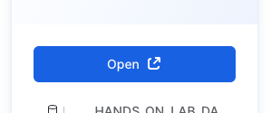
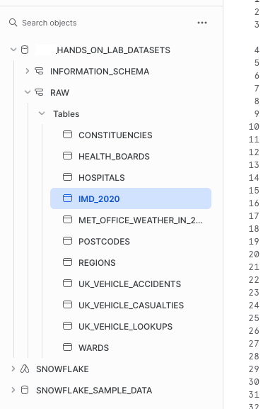
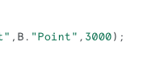

# Hands on Lab focusing on Scotish Health Boards
By Rebecca O'Connor - becky.oconnor@snowflake.com

The following Hands on Lab will take you though collecting data from a data share, exploring the data with some sample SQL queries, then you will create a database with views from the share so you can then create a streamlit application based on the sample code.

### Login with your given username and password

*   Click on the Data Icon - you will see a sample database called SNOWFLAKE_SAMPLE_DATA.  For this lab, we will be using a data from a data share

* Click on Private Sharing.  You should see one Privately Shared Listing

* Click on the Listing to view more details about the dataset.  You will see some information about the data  via the data dictionary.  I have featured 4 of the datasets but you do have the option to view all 11 objects.   Take some time to explore the datasets available in the listing.

If you have access to other listings from other providers - or even your own datasets, you have the ability to combine them together easily.

You will also see useage examples with sample sql queries.  When you press open, these sql examples will be available inside a Snowflake worksheet.

* Press Open to open the dataset into a new worksheet

Opening up the Raw Schema of the NSS_HANDS_ON_LAB_DATASETS database will reveal all the tables within the explorer area

* Highlight IMD_2020 to reveal information about the table - which also includes a dictionary which explains what some of the fields mean.

* Now lets go to the worksheet.  There are a few sophisticated queries in here.

##### Running your first Query

* Position your mouse cursor anywhere inside the first sample query.  TIP - you do not have to highlight the query, the run button will only run up until the end of the query (where you see the semi colon)

* Above is a screenshot of the first query.  To run the query, press ctrl/command and enter.  Alternatively, you can press the run button at the top right hand corner of the screen.  

* When you run the first query, you will see the results appear at the bottom of the screen.  Press  at the bottom left hand corner of the screen to colapse the editor.

* View the Query details on the right - this is a great place to view some quick insights into the shape of your data 

* You can do filterand and sorting as well - take your time to explore this.

* The chart allows you to view the data quickly as a chart.  Below is an example of what you can create

Press  on the bottom left hand side of the screen to open up the SQL editor again.

##### Notes on the query you have just ran

You have just ran a query which filters all the indicies of deprivation metrics by health board.  NB: the Health boards were not connected to the deprivation dataset.  What you have done is create a spatial join to link the Datazone geography boundaries to the Health board boundaries.  The join we used is one of the many hundreds standard advanced analyitical capabilities that snowflake has right outside the box.

You will note we are not viewing the complex geography fields in the table.  I have simply EXCLUDED them from the query via the EXCLUDE feature.

##### Running Query 2 - A summary of casualty types for the Lothian health board

* Ctrl and enter inside the second query to run it as before.  This returns a small dataset which shows the number of queries by casualty type.  We are filtering it to only view one health board in the same way as previously.

##### Query Result

##### Notes on the Query

As before, we filtered the health boards and joined this result to the vehicle incident data.  The vehicle incident dataset also does not have scotish health boards - so simply using the spatial join resolves the problem.

The vehicle incident dataset also does not have descriptions of the casualty types - so we joined the vehicle incident data to the lookup table which gave me all the descriptions we needed.

##### View a List of Hospitals within a specified distance around a chosen postcode

* Amend the next query to a postcode of your choice  

* At the end of the query you will see the number 3000, this means it will reveal all the hospitals within a 3km radius of that postcode. Please note that it will only find hospitals in Scotland!!

* Press Ctrl + Enter to run the query.

##### Notes on the prevously ran query

This query is making use of the function ST_DWITHIN which basically matches locations that sit inside another location BUT with a user defined tolerence level - in this case I used 3000 which means 3km.

The Hospitals itself did not have the locations attached to them - only the postcodes - so i first needed to join to the postcode table which then revealed the POINT for each postcode.

##### Next Query - Combine Weather Data and Vehicle incident data for the Lothian Health Board by data

* Ctrl + Click to run the next query.   We have 'geocoded' all datasets so its aware of the health board - this allowed me to filter all data by health board.    I was then able to join the data by data.  The health board for the weather data i used a tolerence level of 3000 from the centre of the health board - this could have been bigger.

All the weather measures are averages.

* The final queries take you through simple steps to view tables, then join them together.  Run these individually as you wish.

